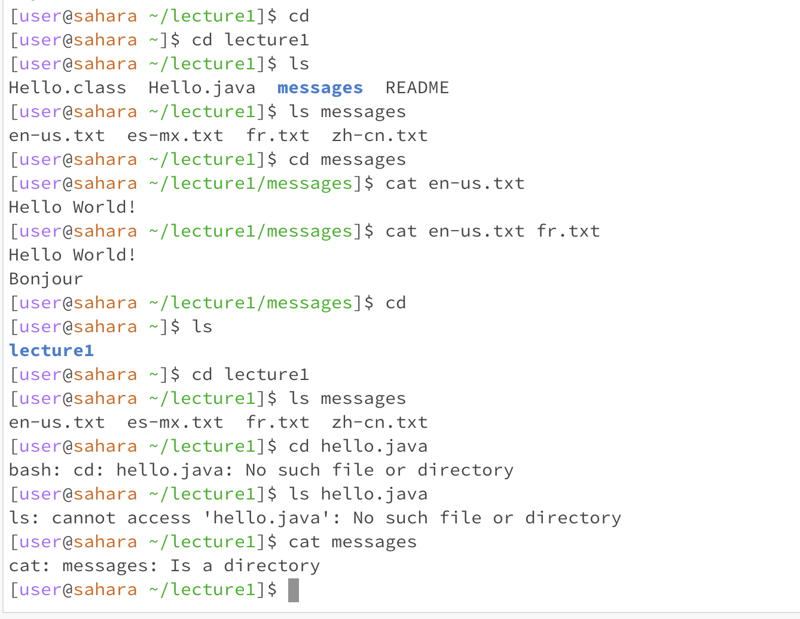

I was at lecture1 when I ran 'cd' with no arg which took me to the parent folder, then I ran 'cd lecture1' which took me to lecture 1. Then I ran 'cd hello.java' which gave me an error since the command works only for a directory.

I was at lecture1 when I ran 'ls' with no argument, then I ran it again as 'ls messages'. Then the last time I tried it I got an error when attempting to run 'ls hello.java' because ls does not work for files.

I was at lecture1/messages when I ran cat en-us.txt which gave me the text for that file. Then I ran it again immediately and 'cat en-us.txt fr.txt' which concatenated both of the text files and output them to the terminal. The no-arg cat and trying to use cat on a directory give an error.
