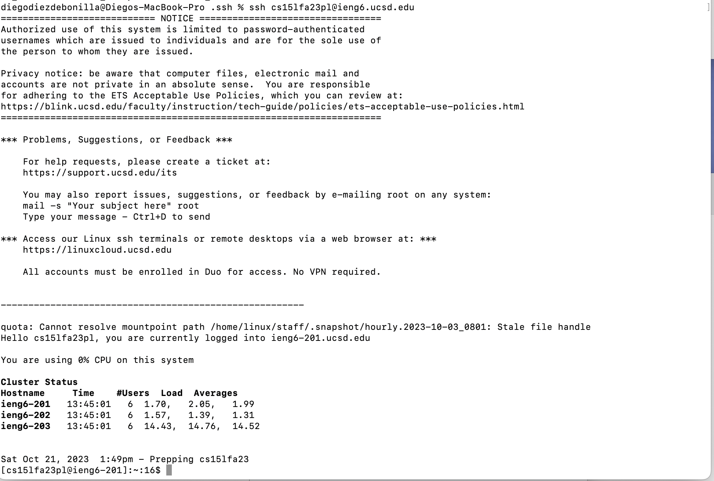
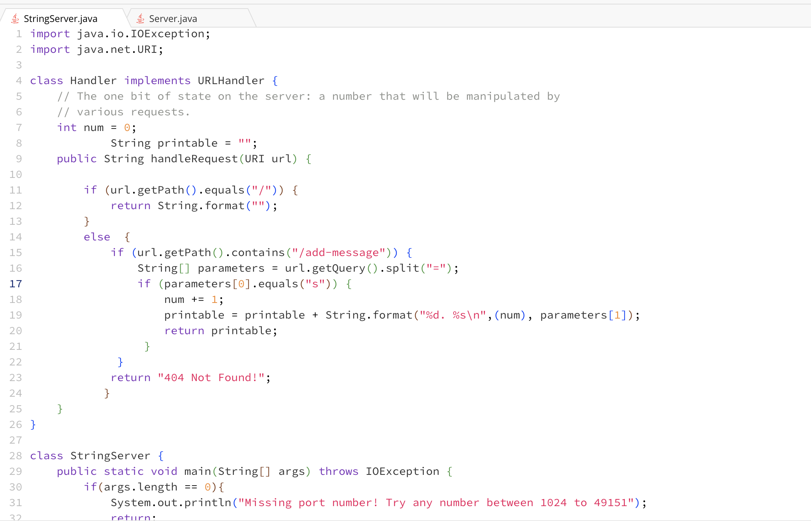

In Week 2 and 3 I was able to learn about servers, and got a better insight into how servers can be set up, implemented or accessed. 
I learned about different parts of the URL like the domain, path, query and the anchor. I also got a better idea of what a server is,
I was able to take code to run a server and modify it to implement functions that allow user input to ve output to the server.
