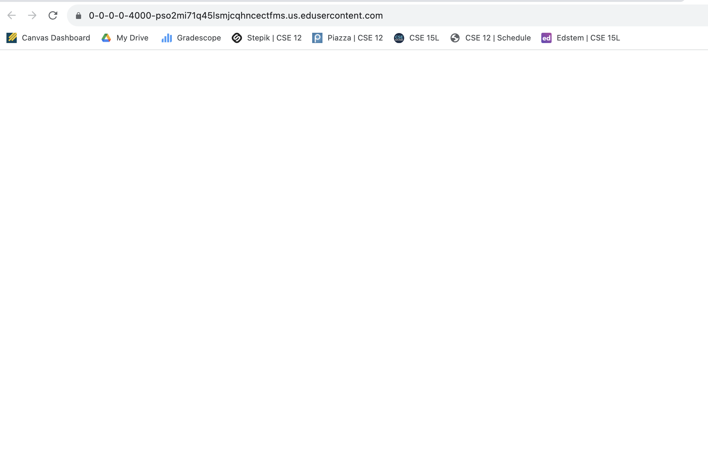
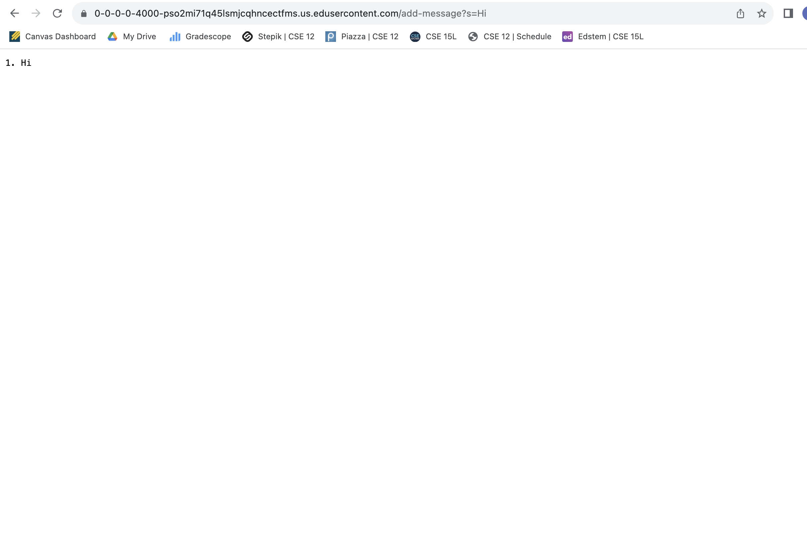
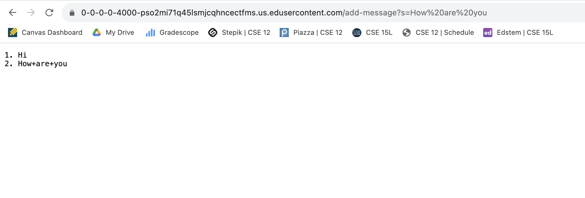
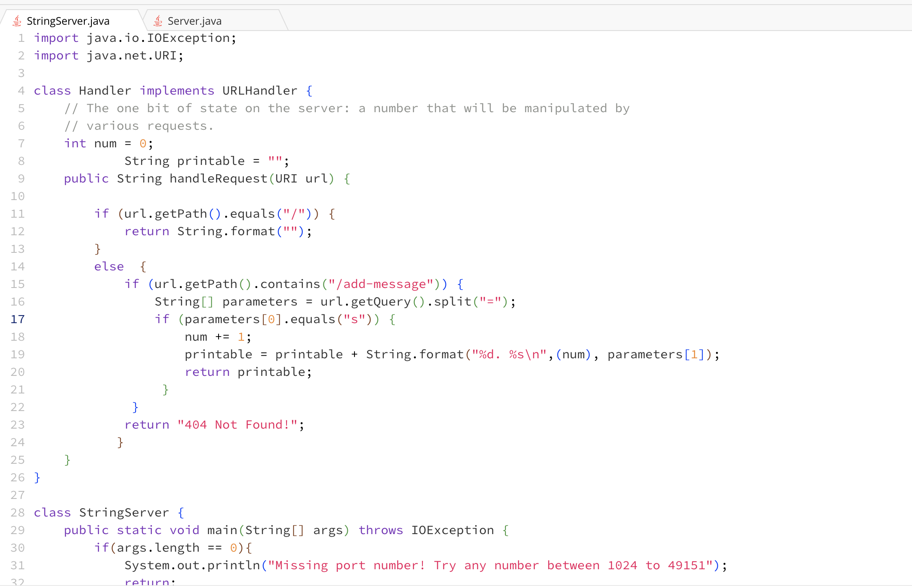
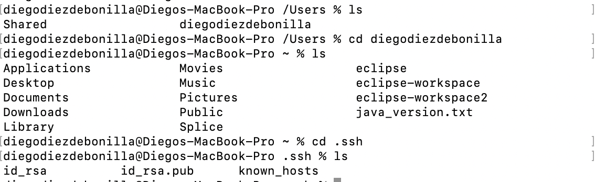
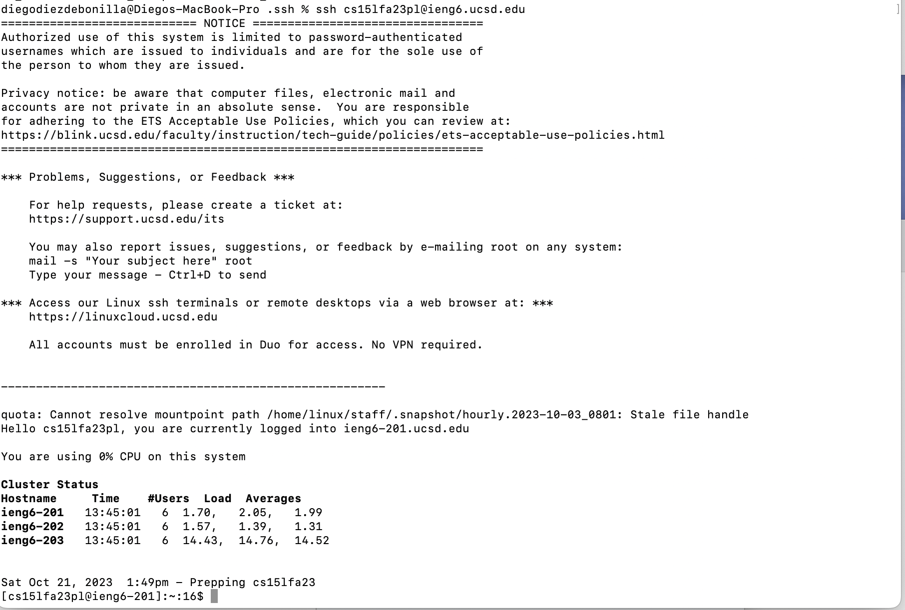

Below is my StringServer I created, that takes my queries and outputs them.

An image of my empty server.

An image of my server after entering one query to `/add-message`.

An image of my server after entering another query to `/add-message`.

And here is the code for my StringServer that I implemented in order to have the server output the query.

Below is my directory holding the id_rsa and id_rsa.pub and me SSHing without having to input login information.

Accessing the directory throught the terminal.

Above is a picture of my terminal as I log into ieng6 without having to input a username or password.

In Week 2 and 3 I was able to learn about servers, and got a better insight into how servers can be set up, implemented or accessed. 
I learned about different parts of the URL like the domain, path, query and the anchor. This gave me a better idea of how a server functions since I was able to take code to run a server and modify it to implement functions. I did this by using the query to take in user input and modifying the input in order to change what the server was outputting.
