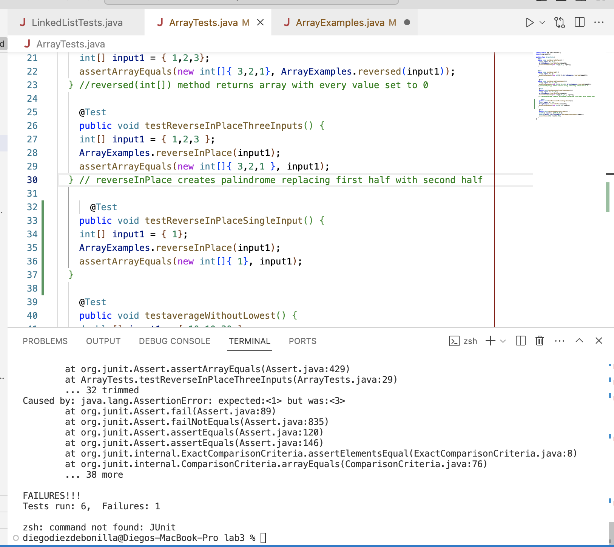

Below is an example of the Junit test I ran that included failure inducing input. I was expecting a reversed list, but instead I got back a palindrome that replaced the first half of the list with the second half.

`@Test
  	public void testReverseInPlaceThreeInputs() {
    int[] input1 = { 1,2,3 };
    ArrayExamples.reverseInPlace(input1);
    assertArrayEquals(new int[]{ 3,2,1 }, input1);
	}` 

 
Next is an example of a test that passed the faulty code. In general, you will not notice the bug when the input is a palindrome, because the output happens to be the same as the reversed input. 

      `@Test
  	public void testReverseInPlaceSingleInput() {
    int[] input1 = { 1};
    ArrayExamples.reverseInPlace(input1);
    assertArrayEquals(new int[]{ 1}, input1);
	}`

 Here is a picture of the output from visual studio code indicating that the first test failed and the second test passed.

1)
`for(int i = 0; i < arr.length; i += 1) {
      arr[i] = arr[arr.length - i - 1];
    }`

2)
  `int temp;
for(int i = 0; i < arr.length/2; i += 1) {
temp = arr[i];
arr[i] = arr[arr.length - i - 1];
arr[arr.length - i - 1] = temp;
}`

To summarize the bug in 1); it keeps the second half of the array the same, and replaces the first half with the reversed second half.
For example: The bug would take input {1,2,3,4,5} and turn in into output {5,4,3,4,5}, a palindrome which alters the first half and leaves the second half unaltered, when we wanted {5,4,3,2,1}, the reversed input.

The modifications shown in 2) adds a placeholder to store the contents of the first half before performing the swap between the two elements, both of which are i indices away from the beginning/end of the array. Also, once the for loop is half way across the array, all elements have been swapped, considering this, I modified the for loop to runs half as many times.

